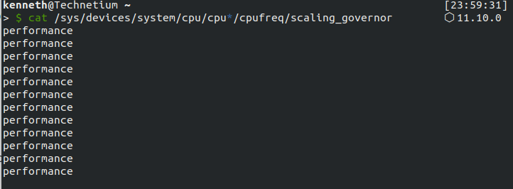

# Configuration

### Install any available updates
Run the following command `sudo apt update && sudo apt dist-upgrade`. Follow any terminal prompts and when updates are complete, restart the computer. 

### Verify that prime-select commands are available
If you selected the option to install third party software, you should be able to run ` sudo prime-select <gpu> ` where gpu can be either nvidia or intel, and then log off and back on to complete the switch. If this doesn't work, try rebooting after the switch.

running the command ` prime-select query ` should show which GPU profile is active.


# Advanced Features

### Multitouch Touchpad Gestures

For multitouch touchpad gestures, you can install libinput-gestures from the below github repo.

https://github.com/bulletmark/libinput-gestures

### Configuring Audio Jack to Work With Microphones

run the command `sudo nano /etc/modprobe.d/alsa-base.conf`    
add `options snd-hda-intel model=dell-headset-multi` to the end of the file    
reboot    

### System Monitoring and Power Management

The following software can be used to monitor temperatures, adjust power management features, and control fans

* TLP - Allows for adjusting power management settings
     ` sudo apt install -y tlp tlp-rdw`    

* HTop - A more advanced version of top for monitoring system load
      ` sudo apt install -y htop`

* PowerTop - Process monitor that shows power usage of running processes
      ` sudo apt install -y powertop`
      
The following guide can be used to configure automatic fan control: [lm-sensors and pwmcontrol setup](http://tuxtweaks.com/2008/08/how-to-control-fan-speeds-in-ubuntu/)   

### Getting Airplane mode button working

The airplane mode button seems to work in TTY mode, but not in GUI mode. this can be fixed by setting the xmodmap for the keycode of the button in GUI mode. To get this working, follow the steps below. 

run the command `gedit ~/.Xmodmap`    
add the following contents, then save the file    
` keycode 255 = XF86WLAN NoSymbol XF86WLAN `   
run the following command ` gedit ~/.config/autostart/my-xmodmap.desktop`    
add the following content, replacing <username> with your username, then save the file          

``` 
[Desktop Entry]
Name=MyXmodmap   
Exec=/usr/bin/xmodmap /home/<username>/.Xmodmap
Terminal=false
Type=Application
X-GNOME-Autostart-enabled=true
```
 
run the command ` chmod +x ~/.config/autostart/my-xmodmap.desktop`

restart the computer. 

The airplane mode button should now work properly

### Setting Governor to performance to prevent lag on battery

#### :no_entry_sign: This may decrease battery life, proceed with caution :no_entry_sign:

The default governor for battery power is balanced. You may notice some lag in certain activities, most notably opening GNOME overview. You can use cpufrequtils to force the governor to performance, which mitigates these performance issues.

To configure cpufrequtils, follow the steps below:     

run the command ` sudo apt install -y cpufrequtils`    
run the command ` sudo nano /etc/default/cpufrequtils`    
add ` SCALING_GOVERNOR="performance"` to the end of the file     
run the command ` sudo systemctl disable ondemand`    
reboot the computer     
run the below command with the laptop unplugged. If the governor is set correctly, the terminal should output "performance"       
` cat /sys/devices/system/cpu/cpu*/cpufreq/scaling_governor`   

the output of the above command will differ from the screenshot below based on your desktop environment, shell or CPU. the below screenshot is taken from 18.04 with GNOME desktop environment, zsh, and the 8750H (6C/12T)    


