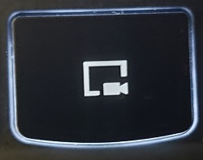
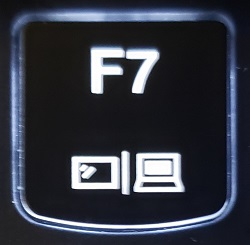

These steps were tested on a Legion with the following Specs, but should work for all configurations:

* Intel&reg;&nbsp; Core&trade; &nbsp;i7-8750H
* 32GB DDR4
* 1920x1080 Resolution (60Hz)
* 512GB NVMe SSD + 500GB SATA SSD
* Geforce GTX 1050Ti + Intel&reg;&nbsp; UHD 630
* Intel 9560 WiFi + BT

However this should work on all configurations.

#### If at any point the machine becomes unresponsive, you can use Magic SysRq to reboot safely

Remember: *<b>R</b>eboot <b>E</b>ven <b>I</b>f <b>S</b>ystem <b>U</b>tterly <b>B</b>roken*

To use Magic SysRq, hold down the right Alt key and PrtSc, and then type (In Order) R, E, I, S, U, B. The machine should then reboot. If for some reason this doesn't work, then hold the power button down to power off the machine. 
 
### Some things to note before Beginning:

* __This guide assumes decent knowledge of the Linux command line__
* __Following this guide will result in Windows being replaced with Ubuntu__
  * However, you can choose to install alongside your current OS.
* __Several features of the Legion will be unavailable on Linux (See Below)__

### Back up your data using Windows Backup or similar before continuing

# Features that will not work

* Screen Record Button - This shares scancodes with L_SHIFT and L_CTRL. Since scancodes cannot be changed without hardware modification, this is not easily fixable. 

* Monitor Switch (Projection Button) - This may press Win + P, so perhaps mapping it is possible

