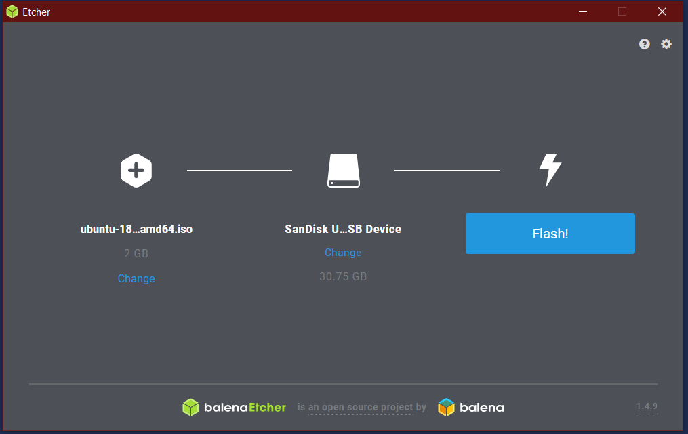
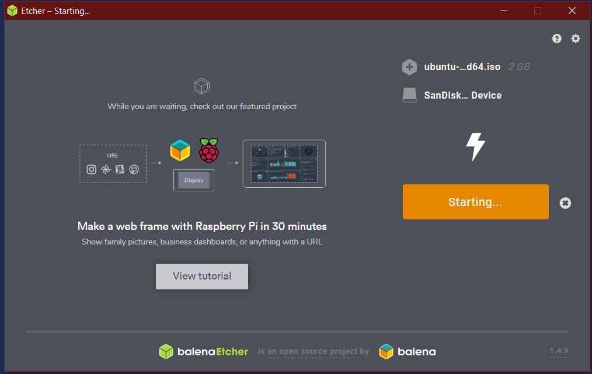
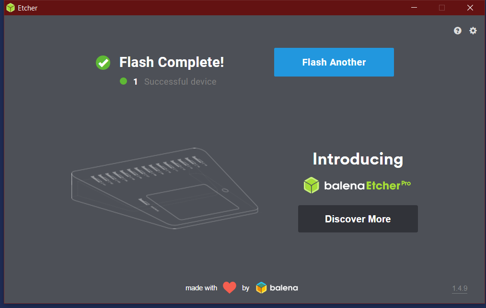

# Create Ubuntu Live USB

## Download Ubuntu LTS disk image and imaging software
**NOTE: Non LTS Releases may work, but are not supported by this guide**
* ~[Ubuntu 20.04 LTS](http://releases.ubuntu.com/20.04/ubuntu-20.04-desktop-amd64.iso)~
* ~[Ubuntu 18.04.4 LTS](http://releases.ubuntu.com/18.04/ubuntu-18.04.4-desktop-amd64.iso)~
*  [Etcher](https://www.balena.io/etcher/)

## Using Etcher, write the image to a USB Drive

After installing and opening Etcher, select your USB device and downloaded .iso and press the button labeled Flash!

Continue to [Disable SecureBoot](DisableSecureBoot.md)
