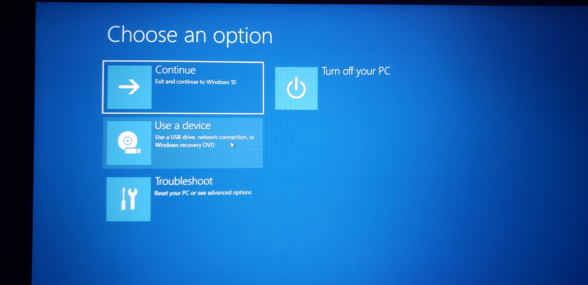
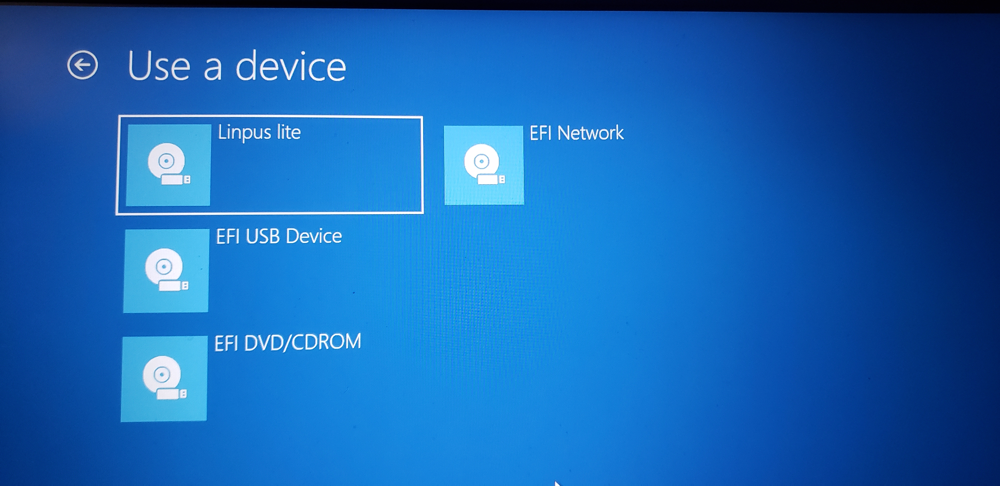

#### This will install Ubuntu leaving SecureBoot enabled. If you want to disable it, follow the guide [here](SecureBootOff.md)

To install Ubuntu, follow the steps below. 

To get to advanced startup, open windows settings, then click Update & Security. Select Recovery from the left hand side, and click the button labeled restart now under Advanced Startup. 

Select the option that says "Use a device".    

Select your USB drive on the following screen. If your USB drive doesn't appear, you can select "EFI USB Device" and follow any on-screen prompts

Once you have booted from your device, press an arrow key before the auto boot completes. Then highlight "try ubuntu without installing" and press e. 

Find the line with quiet splash and add "nouveau.modeset=0" then press F10.

    
     
    
Continue to [Installation](Installation.md)