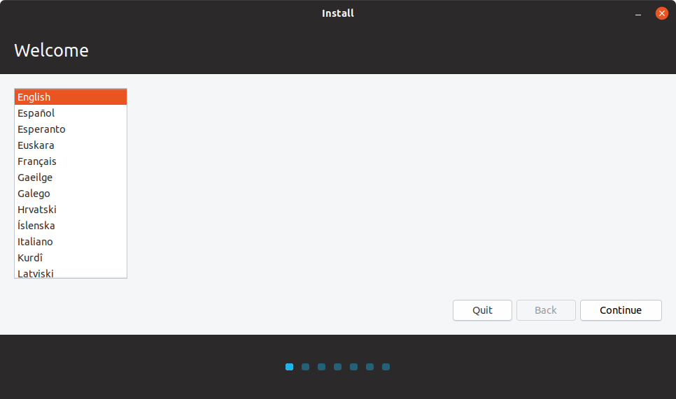
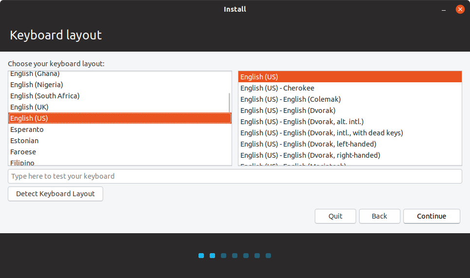
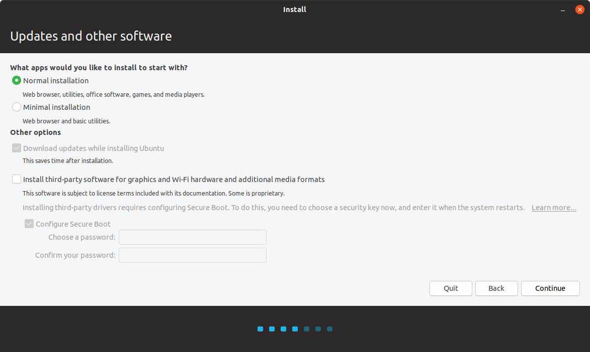
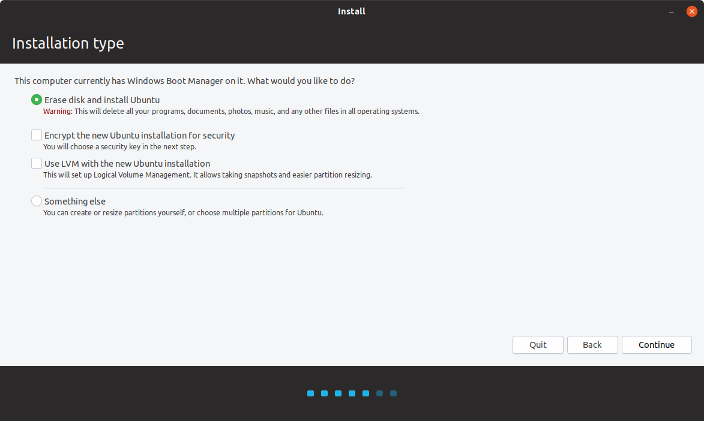
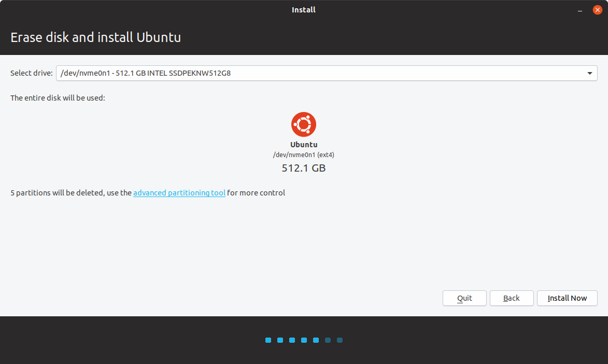

# Install Ubuntu

Once the desktop loads, double click the setup icon on the desktop. It should have a label with the words "Install Ubuntu"

The following screenshots are from a 18.04.3 installation. If you are using a different version, the options or UI may be different. Available drives will differ based on what hardware is installed in your laptop

__Note: Ubuntu 18.04.3 and up can automatically install the graphics drivers. make sure to select the checkbox to install the drivers.__   

Once you click install now, the installation will ask you a few questions (Time Zone, Username, machine name, password, login options). Provide values for the settings and then sit back and watch the progress.

Once the Installation completes, you can select the reboot option. Complete the wizard, then continue with the guide.

##### Install any available updates

Run the following command `sudo apt update && sudo apt dist-upgrade`. Follow any terminal prompts and when updates are complete, restart the computer. 

#### __Note: After this, you should be able to run ` sudo prime-select <gpu> ` where gpu can be either nvidia or intel, and then log off and back on to complete the switch. If this doesn't work, try rebooting after the switch.__    

If you want some additional configurations or helpful software, you can view the [Advanced Features Guide](Advanced.md)
