# Install Ubuntu

Once the desktop loads, double click the setup icon on the desktop. It should have a label with the words "Install Ubuntu"

The following screenshots are from a 18.04.3 installation. If you are using a different version, the options or UI may be different. Available drives will differ based on what hardware is installed in your laptop

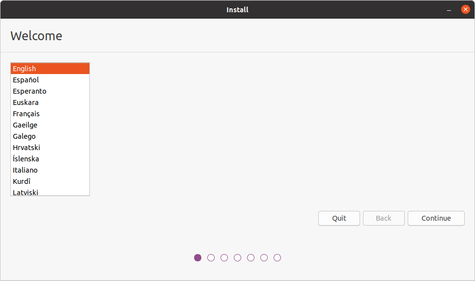

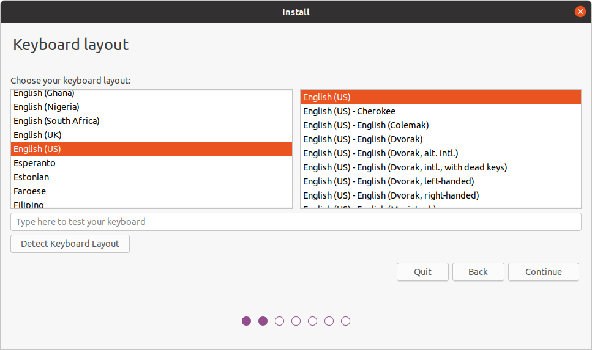

__Note: The network screen may or may not appear Depending on whether or not you are already connected.__

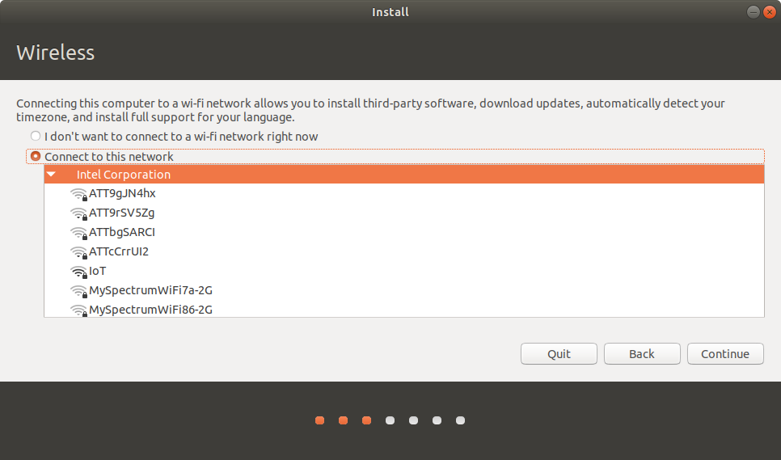

__Note: The option for installing third party software is optional, however it is recommended to select this.__

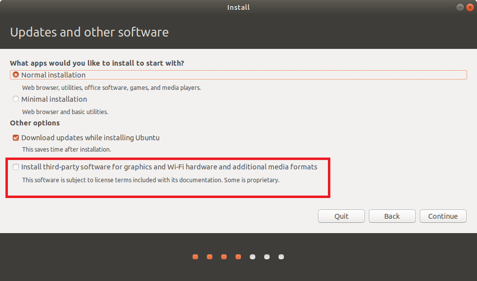

__Note: Depending on your machine configuration, you may see different options for installation here__
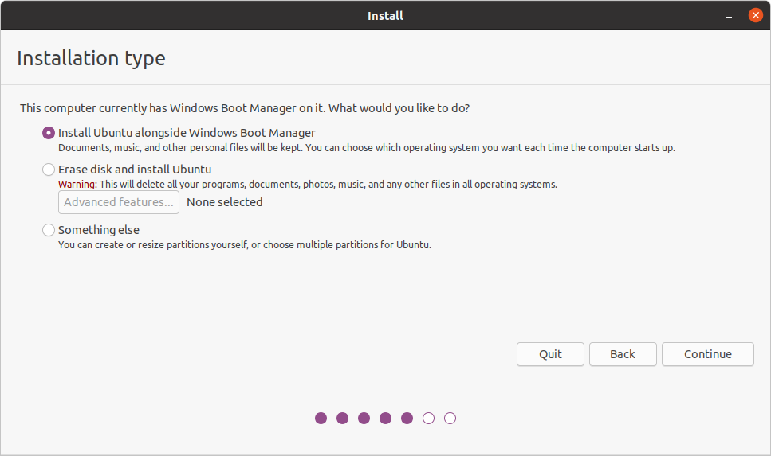

Depending on what you select on the previous screen, you will get one of the two following screens. they allow you to select which drive to install on. 

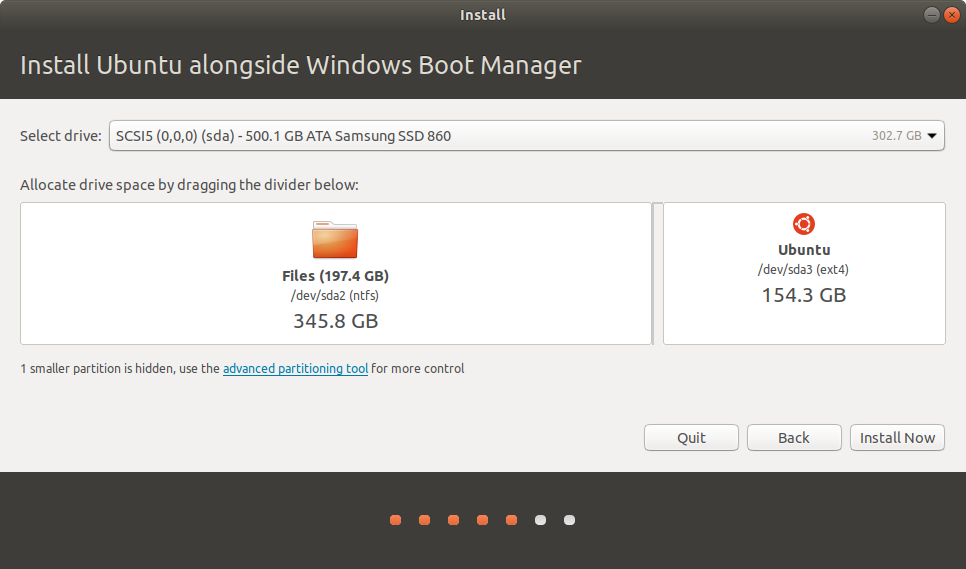

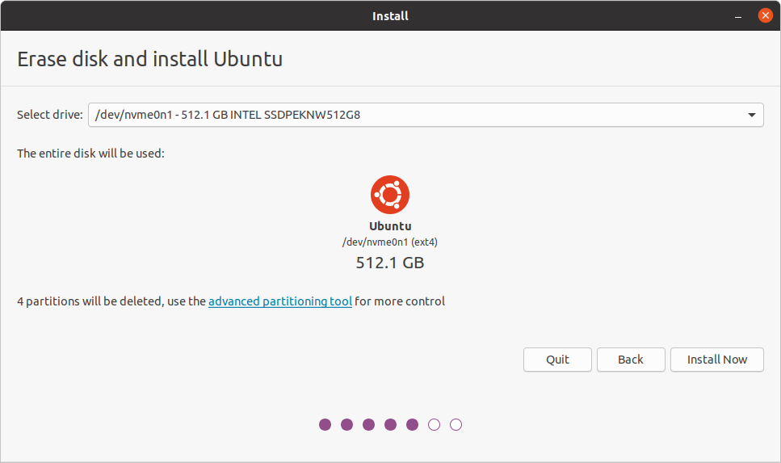

Once you click the install now button, you will see the parition confirmation dialog. 

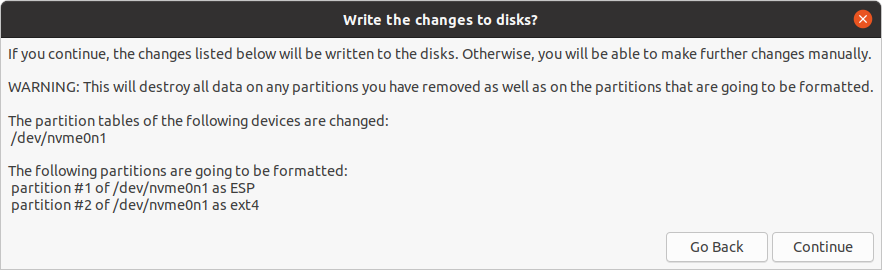

The next two screens will allow you to configure time zone, user, and machine name

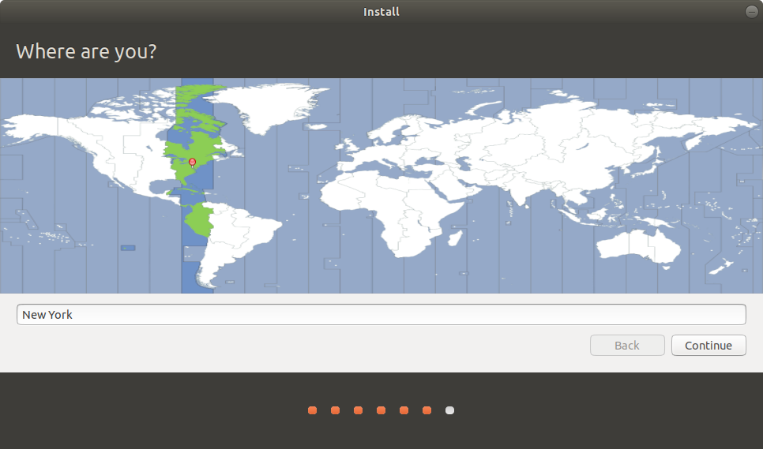

You will then see a screen with a progress bar showing the install progress. Once you see the installation complete dialog, select the option to reboot, then continue with the guide. 

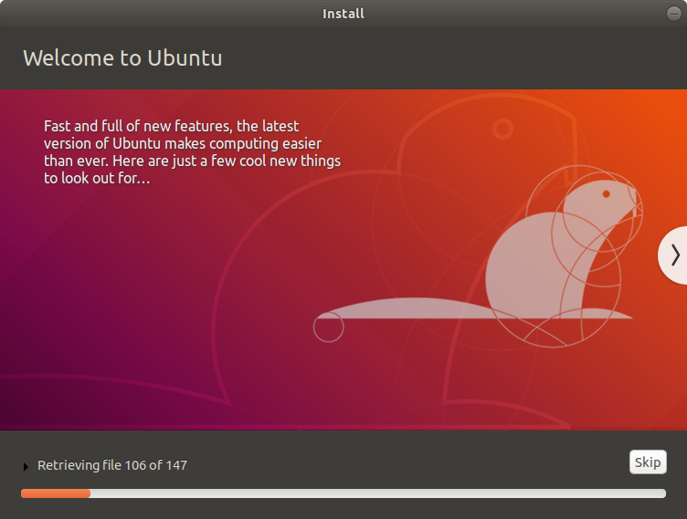

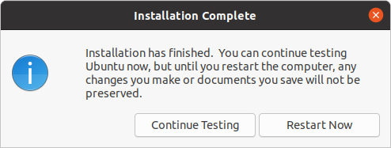 

Continue to [Configuration](Configuration.md)
