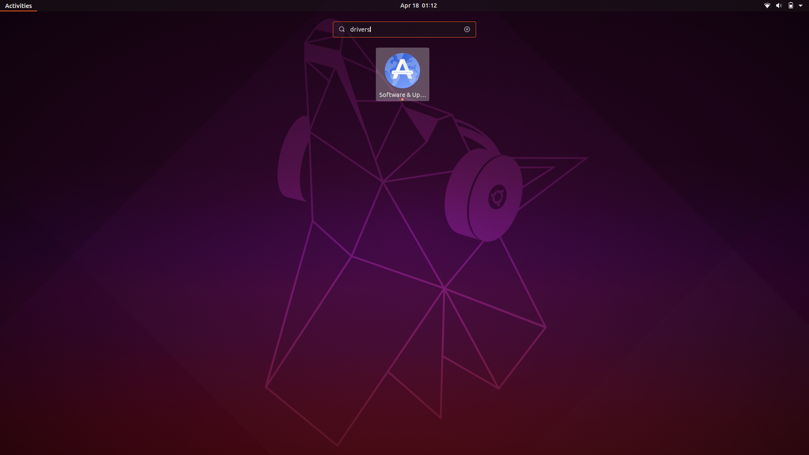
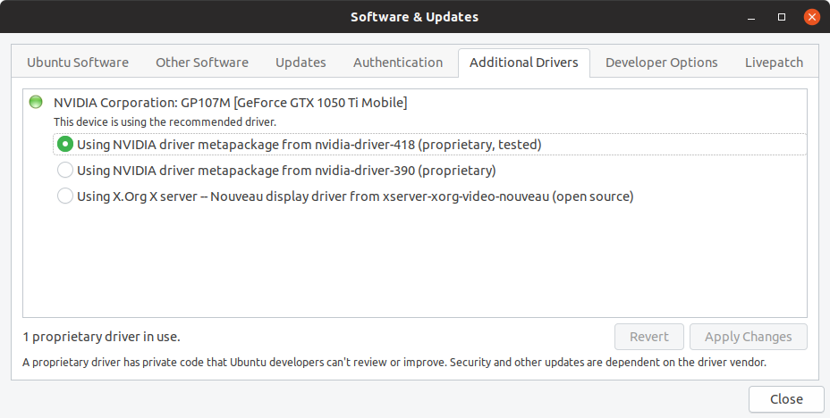
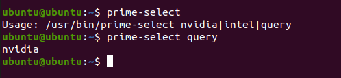

# Install Nvidia proprietary drivers

Press the Super Key (Button with windows Logo), then type drivers. you should see a screen similar to the following

Select the icon for Software & Updates. 

On the window that appears, click the Additional Drivers tab

Select the nvidia-driver-418 option and click Apply changes. It should ask for your password, then install the driver. Once installed, the text "1 proprietary driver in use" should appear below the driver selection as in the screenshot. 

Verify that prime-select has been installed by opening a terminal and running the command ` prime-select query`

you should get the output `nvidia `

You may now reboot the computer without performing the nouveau.modeset=0 steps. You should get the login screen and be able to login.

#### __Note: After this, you should be able to run ` sudo prime-select <gpu> ` where gpu can be either nvidia or intel, and then log off and back on to complete the switch. If this doesn't work, try rebooting after the switch.__

Your OS is fully configured, but if you want some additional configurations or helpful software, you can view the [Advanced Features Guide](Advanced.md)
