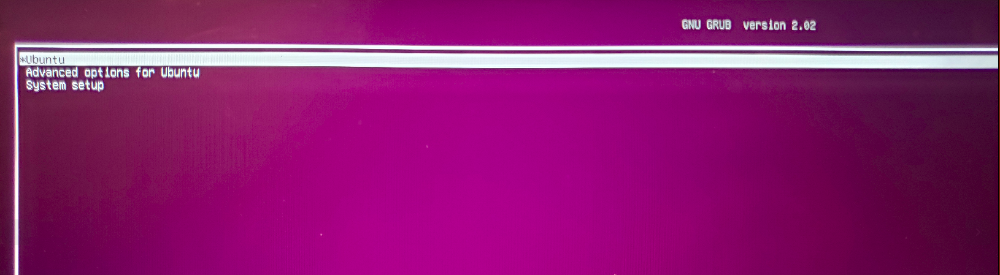
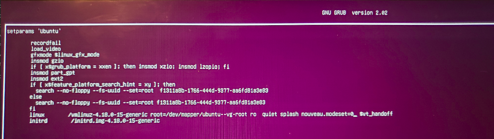

# Common Issues and how to solve them

### WiFi Doesn't work

open a terminal and run the command `lspci | grep -i realtek` If you see a line containing a realtek wifi card, then follow these steps to configure the realtek module and get wifi working

run the command `echo "options r8822be aspm=0" | sudo tee /etc/modprobe.d/r8822be.conf`    
run the command `sudo rmmod r8822be`    
run the command `sudo modprobe r8822be`

**Note: If this does not work, you may need to update your BIOS. However, this requires Windows.**

### Installation has warning about disabling Intel Rapid Storage Technology (iRST)
If your machine came configured with iRST (Generally only optane models), 20.04 may show you a warning telling you to turn it off. If this happens, in the BIOS, change the SATA mode to AHCI instead of Intel RST Premium [Issue #99](https://github.com/kfechter/LegionY530Ubuntu/issues/99)

**NOTE: If windows has been installed with Optane or RST configured, disabling it will likely render Windows non bootable.**

### Laptop seems to freeze before/after/during login screen

If your laptop seems to freeze at any point before installing the nvidia drivers, you may need to disable nouveau modeset during boot until the drivers are installed. To disable modeset, follow the steps below.

reboot the machine either by Magic SysRq or by holding the power button down and turning it back on.

As soon as the screen turns purple (After the Legion logo screen), press esc. You should see a screen similar to the following.

highlight the entry that says "Ubuntu" and press 'e', you should get a screen that looks similar to the following.

find the section that says 'quiet splash', and add `nouveau.modeset=0` to it so it reads 'quiet splash nouveau.modeset=0'

press F10 to boot with the changes.

### Nvidia switching doesn't seem to be working (i.e, nvidia mode enabled and external screens don't work)

if after doing sudo prime-select nvidia, you notice that external screens don't work. Try logging out and back in. If they still don't work, then reboot the machine. 

##### __Note: If you deviate from the stock kernel, this may cause issues with the nvidia drivers__

##### __Note: the nvidia-44x drivers seem to have issues with 20.04. Reccomendation is downgrade to 435 through the additional drivers settings.__

### Ubuntu does not detect my nvidia card
This seems to be a result of doing an in-place upgrade from 18.04/19.xx with working GPU drivers to 20.04. The only solution in this scenario is to perform a clean install. Reported by [@matdurand](https://github.com/matdurand). [Github Issue #98](https://github.com/kfechter/LegionY530Ubuntu/issues/98)

### Ubuntu doesn't detect my disk drives/Doesn't detect Windows is installed.

Kudos to Github user [@tommyalvarez](https://github.com/tommyalvarez) and [This site](https://davidvielmetter.com/tricks/installing-ubuntu-dual-boot-on-a-dell-precision-which-already-runs-windows-10/) for this information

The most likely cause is you have optane. You can confirm this by opening PowerShell as an administrator and running the following command 

` Get-PhysicalDisk`

If the output contains a device with a FriendlyName of Intel Optane+xxxGB HDD Where xxx will be a capacity, you have optane. To get ubuntu installed in a dual boot scenario with optane follow the steps below. 

Instead of selecting "Install Ubuntu," select the "Try Ubuntu" option. Then open a terminal and issue the following command

` sudo dmraid -E -r /dev/sda`

It will ask if you want to delete metadata, you can say yes to this. 

You can now exit the terminal and follow the guide to install Ubuntu in a dualboot scenario

### When you enter your password and click Enter you get the login screen again

On the login screen press Ctrl + Alt + F3
Then log in in the console  
First you enter your name(The name you chose when you installed Ubuntu)  
Then you enter your password(! Note: The password is not shown when typed)  
Then press enter  
After you are logged in type the following commands:  
&nbsp;&nbsp; cd /  
&nbsp;&nbsp; cd etc/default/  
&nbsp;&nbsp; sudo nano grub  
Delete the word splash  https://prnt.sc/u8s87l   →  https://prnt.sc/u8s98x  
Press Ctrl + X to save  
Select “Yes”  
Input command:  
&nbsp;&nbsp; sudo update-grub  
Hold Alt and the right arrow key until you go back to the login screen
Restart  